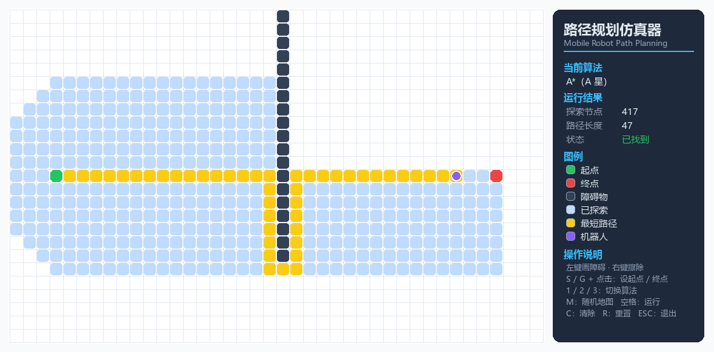

# 移动机器人路径规划与避障可视化仿真器
**Mobile Robot Path Planning & Obstacle-Avoidance Visual Simulator**

在可交互编辑的栅格地图上，移动机器人使用 **A\*** 算法实时规划出从起点到终点的最短无碰撞路径，并以动画演示「搜索过程 → 最短路径 → 机器人行走」。支持 A\* / Dijkstra / 贪婪最佳优先三种算法一键切换对比。

> 一套算法，两种界面：**浏览器在线版**（零安装、手机可开）+ **pygame 桌面版**；算法与界面完全解耦，并用 Node 对 Python 实现做了逐格交叉验证。

### 🔗 在线演示（零安装，手机也能开）
**👉 [点此打开在线演示](__LIVE_URL__)** —— 在浏览器里直接画障碍、设起终点，看 A\* 实时搜索并让机器人走过去。

---

## ✨ 功能特性
- 🌐 **浏览器在线版**：纯 HTML Canvas + 原生 JavaScript，零依赖、零构建，打开链接即玩，桌面与手机触屏都支持
- 🗺️ **交互式地图编辑**：拖动绘制 / 擦除障碍物，自由设置起点与终点（电脑右键拖动擦除，手机用工具切换）
- 🤖 **三种经典规划算法**：A\*、Dijkstra、贪婪最佳优先（Greedy Best-First），一键切换
- 🎞️ **实时可视化动画**：区分「搜索边界(开集)」与「已探索(闭集)」的扩散过程，再到最终最短路径与机器人平滑行走
- ⚡ **一键三算法对比**：在同一张地图上同时跑三种算法，用真实数字展示「探索节点数 / 路径长度」的差异
- 🧱 **工程化结构**：算法（`pathfinding.py` / `pathfinding.js`）与界面（`app.py` / `app.js`）完全解耦
- 🧪 **双重测试**：Python 单元测试 + 用 Node 对 JS 移植做逐格交叉验证，证明两套实现行为完全一致

## 🎬 界面预览


> 上图为程序运行界面。**想直接体验交互动画**：打开上方的 [在线演示](__LIVE_URL__) 即可（无需安装）。
> 想放一段**动态 GIF**：按 `docs/HOW_TO_RECORD_DEMO.txt` 录制，命名为 `demo.gif` 放进 `docs/`，再取消下面这行注释即可。
>
> <!--  -->

## 🚀 快速开始

**方式一：在线版（推荐，零安装）**
直接打开 👉 **[在线演示](__LIVE_URL__)**

**方式二：本地运行网页版**
```bash
# 任选其一：直接用浏览器打开 web/index.html
# 或起一个本地静态服务器（推荐，行为与线上一致）：
python -m http.server 8000
# 然后浏览器访问 http://localhost:8000/web/
```

**方式三：桌面版（pygame）**
```bash
pip install -r requirements.txt
python app.py
```

## 🎮 操作说明

**网页版**

| 操作 | 功能 |
|---|---|
| 在网格上按住拖动 | 用当前工具绘制（画障碍 / 擦除 / 起点 / 终点） |
| 右键拖动（电脑） | 快速擦除障碍 |
| 「算法」分段按钮 / `1` `2` `3` | 切换 A\* / Dijkstra / 贪婪 |
| ▶ 运行 / `空格` | 运行规划（带动画），再按可暂停 / 继续 |
| 单步 | 一格格手动推进搜索（适合讲解） |
| ⚡ 对比 | 在当前地图上对比三种算法的指标 |
| 随机地图 / `M` · 清痕迹 / `C` · 重置 / `R` | 生成随机地图 / 清除搜索痕迹 / 清空地图 |

**桌面版（pygame）**

| 操作 | 功能 |
|---|---|
| 鼠标左键拖动 | 绘制障碍物 |
| 鼠标右键拖动 | 擦除障碍物 |
| 按 `S` 后点击 | 设置起点（绿色） |
| 按 `G` 后点击 | 设置终点（红色） |
| `1` / `2` / `3` | 切换算法：A\* / Dijkstra / 贪婪 |
| `空格` | 运行路径规划（带动画） |
| `C` · `R` · `ESC` | 清除痕迹 · 重置地图 · 退出 |

## 🧠 算法说明
三种算法的核心区别**仅在于「优先级 f」如何计算**（对应 `plan()` 里的一行）：

| 算法 | 优先级公式 | 是否用启发式 | 是否保证最短 | 特点 |
|---|---|---|---|---|
| Dijkstra | `f = g` | 否 | ✅ 是 | 向四周均匀扩展，慢、探索范围大 |
| 贪婪 Greedy | `f = h` | 是 | ❌ 否 | 一头扎向终点，快但易绕远 |
| **A\*** | `f = g + h` | 是 | ✅ 是 | 又快又准，机器人导航主力算法 |

- `g` = 从起点到当前格子**已经走过**的真实代价
- `h` = 当前格子到终点的**估计**代价（曼哈顿距离）
- A\* = **Dijkstra 的「保证最短」 + 贪婪的「朝目标走」**，兼得两者优点。

**一个真实例子**（25×40 随机地图，同一起终点，取自本仓库测试数据）：

| 算法 | 路径长度 | 探索节点数 |
|---|---|---|
| **A\*** | **45（最短）** | **230** |
| Dijkstra | 45（最短） | 636 |
| 贪婪 Greedy | 51（偏长） | 72 |

> A\* 与 Dijkstra 都找到最短的 45 步，但 A\* 靠启发式只探索了 **230** 个节点，约为 Dijkstra（636）的 **1/2.8**；贪婪探索最少却得到偏长的 51 步。这正是 A\* 在机器人导航里成为主力的原因。

## 🧪 测试与验证
```bash
# 1) Python 算法单元测试（空地直线 / 绕墙 / 无解 / A*==Dijkstra 最短一致）
python test_pathfinding.py

# 2) 跨语言交叉验证：用 Node 跑 JS 移植，与 Python 的“标准答案”逐格核对
node web/verify.js
```
`web/golden.json` 是用 Python 版跑出来的期望结果；`web/verify.js` 用 JS 版在相同地图上重跑，逐项核对 `found / 路径 / 步数 / 探索节点数 / 探索顺序`，**15/15 全部一致** —— 证明 JS 移植与 Python 行为完全相同。

## 📁 项目结构
```
robot-path-planner/
├── index.html             # 在线演示入口（重定向到 web/，便于 GitHub Pages）
├── web/                   # 浏览器版（零依赖）
│   ├── index.html         #   页面结构
│   ├── styles.css         #   样式
│   ├── pathfinding.js     #   核心算法（A*/Dijkstra/贪婪，pathfinding.py 的忠实移植）
│   ├── app.js             #   Canvas 渲染、交互与动画
│   ├── verify.js          #   用 Node 对照 Python 的交叉验证脚本
│   └── golden.json        #   Python 版生成的“标准答案”
├── pathfinding.py         # 桌面版核心算法（与界面解耦，纯函数）
├── app.py                 # pygame 桌面图形界面与动画
├── test_pathfinding.py    # Python 算法单元测试（4 个用例）
├── requirements.txt       # 桌面版依赖：pygame
├── docs/                  # 界面预览图 / 演示 GIF 及录制说明
└── README.md
```

## 🔭 未来扩展（Roadmap）
- [ ] 八方向移动（对角线），启发式改用对角 / 欧氏距离
- [ ] 加权地形（不同地面通行代价不同）
- [ ] 动态障碍 + 实时重规划（D\* Lite）
- [ ] 局部避障：DWA（动态窗口法）
- [ ] 连续空间采样规划：RRT / RRT\*
- [ ] 接入 ROS，驱动真实 / Gazebo 仿真机器人

---
作者：<你的名字> ｜ 机器人工程专业 ｜ Python · JavaScript · 路径规划 · 数据结构与算法
